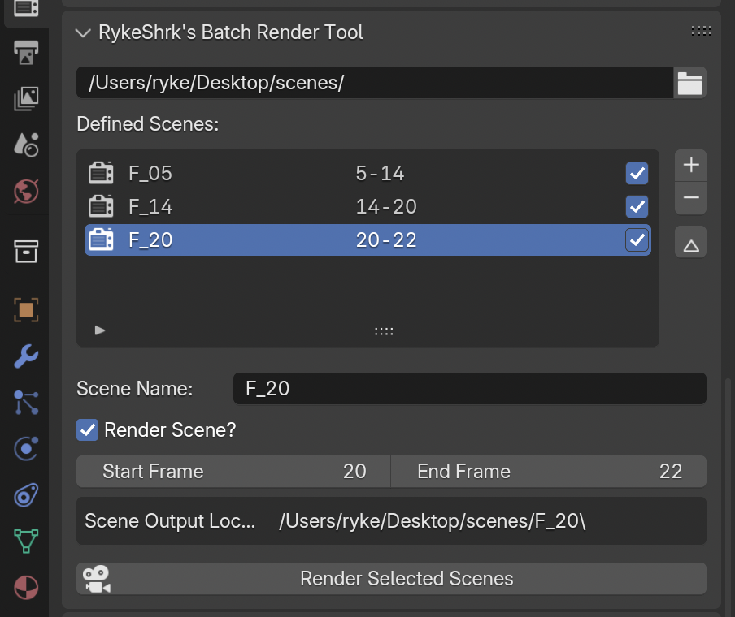

# RykeShrk's Batch Render tool

A blender extension that allows you to render out specific sections of a singular scene onto different sections in their
own folders.

Mainly done given that this is my workflow for animations and it was getting annoying having to rename the output folder so many times and then screwing that up.

## Install

### Automatic install

Download the extension from my [website](https://rykeshrk.com/blender-add/batchrendertool/), and just drag and drop the install button onto the viewport!
You'll be prompted to install it once you let go.

### Manual install

- Download the extension from my [website](https://rykeshrk.com/blender-add/batchrendertool/) or the releases page.
- Open the extensions panel on Blender's Preferences.
- Click on the small dropdown button on the top left corner of the window and click "Install from Disk..."
- Select the zip file containing the extension.

## Usage

Once installed, you'll see the tool located on the Render section of the Properties window.

The settings are as follows:
 
- Output Folder Location
Sets the global folder location where every scene will be saved to. Think of it as the starting location. Every scene will
be stored as folders inside that folder.

**Note:** This location is a relative path!

- Defined scenes
This is where you'll declare which scenes will be rendered out, their name and how long they will be.
Use the New and Remove buttons to add a new scene and to delete one.

When selecting a scene, extra options will be shown below those buttons.

- Scene Name

	What's the name of the scene? This will the the name of the folder it will output to.

- Render Scene?

	Tells the extension if it should render this scene on this batch.

- Start/End frame

	Define where the scene starts and ends.
	
- Scene Output Location

	This is an automatic label that will display where the final location of this scene will be rendered out to. The format is `///[Output Folder Location]/[Scene Name]`.